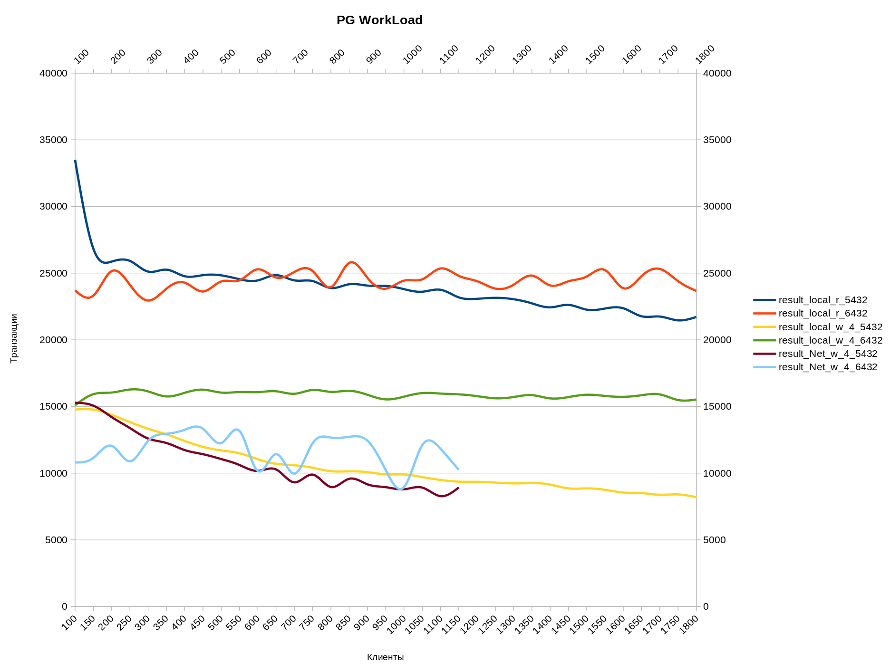

### Virtual Machine configuration:

[OS]         Ubuntu "22.04.5 LTS (Jammy Jellyfish)"

[kernel]     5.15.0-131-generic #141-Ubuntu SMP Fri Jan 10 21:18:28 UTC 2025 x86_64

[CPU]        CPU(s): 8   Intel(R) Xeon(R) CPU E5-2680 v4 @ 2.40GHz 

[RAM]        32Gb

[Hypervisor] VirtualBox

[HostOS]     FreeBSD: 14.1 p5 AND64


### Dafault configuration for PostgreSQL by default (after install it)

- Get config ``cat /etc/postgresql/17/main/postgresql.conf | grep -E -v "^#|^[[:space:]]*#" | sed '/^$/d'``
```shell
data_directory = '/var/lib/postgresql/17/main'				# use data in another directory
hba_file = '/etc/postgresql/17/main/pg_hba.conf'			# host-based authentication file
ident_file = '/etc/postgresql/17/main/pg_ident.conf'			# ident configuration file
external_pid_file = '/var/run/postgresql/17-main.pid'			# write an extra PID file
listen_addresses = '*'				# Временно, для тестовой лаборатории
port = 5432					# (change requires restart)
max_connections = 2000				# (change requires restart)
superuser_reserved_connections = 3		# (change requires restart)
unix_socket_directories = '/var/run/postgresql' # comma-separated list of directories
ssl = on
ssl_cert_file = '/etc/ssl/certs/ssl-cert-snakeoil.pem'
ssl_key_file = '/etc/ssl/private/ssl-cert-snakeoil.key'
shared_buffers = 128MB			# min 128kB
dynamic_shared_memory_type = posix	# the default is usually the first option
max_wal_size = 1GB
min_wal_size = 80MB
log_line_prefix = '%m [%p] %q%u@%d '	# special values:
log_timezone = 'Europe/Moscow'
cluster_name = '17/main'		# added to process titles if nonempty
datestyle = 'iso, dmy'
timezone = 'Europe/Moscow'
lc_messages = 'ru_RU.UTF-8'		# locale for system error message
lc_monetary = 'ru_RU.UTF-8'		# locale for monetary formatting
lc_numeric = 'ru_RU.UTF-8'		# locale for number formatting
lc_time = 'ru_RU.UTF-8'			# locale for time formatting
default_text_search_config = 'pg_catalog.russian'
include_dir = 'conf.d'			# include files ending in '.conf' from
```

- ``pg_hba`` file
```shell
sudo cat /etc/postgresql/17/main/pg_hba.conf | grep -E -v "^#|^[[:space:]]*#" | sed '/^\s*$/d'
local   all             postgres                                peer
host    all             all             192.168.10.0/24         scram-sha-256
local   all             all                                     peer
host    all             all             127.0.0.1/32            scram-sha-256
host    all             all             ::1/128                 scram-sha-256
local   replication     all                                     peer
host    replication     all             127.0.0.1/32            scram-sha-256
host    replication     all             ::1/128                 scram-sha-256
```

---
### Config from: [CYBERTIC PostgreSQL Configurator](https://pgconfigurator.cybertec.at/)
```shell
# Connectivity
max_connections = 2000
superuser_reserved_connections = 3

# Memory Settings
shared_buffers = '8192 MB'
work_mem = '32 MB'
maintenance_work_mem = '420 MB'
# NB! requires also activation of huge pages via kernel params, 
# see here for more: https://www.postgresql.org/docs/current/static/kernel-resources.html#LINUX-HUGE-PAGES
huge_pages = try
effective_cache_size = '22 GB'
effective_io_concurrency = 100 # concurrent IO only really activated if OS supports posix_fadvise function
random_page_cost = 1.25 # speed of random disk access relative to sequential access (1.0)

# Monitoring
shared_preload_libraries = 'pg_stat_statements'    # per statement resource usage stats
track_io_timing=on        # measure exact block IO times
track_functions=pl        # track execution times of pl-language procedures if any

# Replication
wal_level = replica		# consider using at least 'replica'
max_wal_senders = 0
synchronous_commit = on

# Checkpointing: 
checkpoint_timeout  = '15 min' 
checkpoint_completion_target = 0.9
max_wal_size = '1024 MB'
min_wal_size = '512 MB'


# WAL writing
wal_compression = on
wal_buffers = -1    # auto-tuned by Postgres till maximum of segment size (16MB by default)
wal_writer_delay = 200ms
wal_writer_flush_after = 1MB


# Background writer
bgwriter_delay = 200ms
bgwriter_lru_maxpages = 100
bgwriter_lru_multiplier = 2.0
bgwriter_flush_after = 0

# Parallel queries: 
max_worker_processes = 16
max_parallel_workers_per_gather = 8
max_parallel_maintenance_workers = 8
max_parallel_workers = 16
parallel_leader_participation = on

# Advanced features 
enable_partitionwise_join = on 
enable_partitionwise_aggregate = on
jit = on
wmax_slot_wal_keep_size = '1000 MB'
track_wal_io_timing = on
maintenance_io_concurrency = 100
wal_recycle = on
```
---
## Install PGPouncer
```shell
apt install pgbouncer -y
# dpkg -s pgbouncer | grep 'Version:'
Version: 1.23.1-1.pgdg22.04+1

# ls -la /etc/pgbouncer/

drwxr-xr-x   2 root     root      4096 фев  7 21:22 .
drwxr-xr-x 149 root     root     12288 фев  7 21:22 ..
-rw-r-----   1 postgres postgres 10515 авг  3  2024 pgbouncer.ini
-rw-r-----   1 postgres postgres     0 авг  3  2024 userlist.txt

# systemctl status pgbouncer | head -n3
● pgbouncer.service - connection pooler for PostgreSQL
     Loaded: loaded (/lib/systemd/system/pgbouncer.service; enabled; vendor preset: enabled)
     Active: active (running) since Fri 2025-02-07 21:22:18 MSK; 4min 49s ago
```
### Stop PGBouncer
 ```shell
systemctl stop pgbouncer; systemctl status pgbouncer
cd /etc/pgbouncer


# cat pgbouncer.ini | grep -v "^;"|sed '/^\s*$/d'

[databases]
[users]
[pgbouncer]
logfile = /var/log/postgresql/pgbouncer.log
pidfile = /var/run/postgresql/pgbouncer.pid
listen_addr = localhost
listen_port = 6432
unix_socket_dir = /var/run/postgresql
auth_type = md5
auth_file = /etc/pgbouncer/userlist.txt
```

### Configure [PGBouncer](https://www.pgbouncer.org/config.html)

* create config file
```shell
mv pgbouncer.ini pgbouncer.ini.orig

cat > /etc/pgbouncer/pgbouncer.ini << EOF

[databases]
thai = host=localhost port=5432
[users]
[pgbouncer]
logfile = /var/log/postgresql/pgbouncer.log
pidfile = /var/run/postgresql/pgbouncer.pid
listen_addr = *
listen_port = 6432
unix_socket_dir = /var/run/postgresql
auth_type = scram-sha-256
auth_file = /etc/pgbouncer/userlist.txt
admin_users = adm
max_client_conn = 2000
default_pool_size = 100
EOF
```
* Create users
```shell
psql -c "ALTER USER postgres WITH PASSWORD 'P@ssw0rd';";
psql -c "CREATE USER adm WITH PASSWORD '111345';";
```

* Get users hashes from PG and put it into ``userlist.txt`` file:
```shell
psql -h localhost -U postgres -p 5432 -W -Atc "SELECT concat('\"', usename, '\" \"', passwd, '\"') FROM pg_shadow ORDER BY 1" > /etc/pgbouncer/userlist.txt

root@xu22-pg01:/etc/pgbouncer# chmod 600 userlist.txt

root@xu22-pg01:/etc/pgbouncer# ll
drwxr-xr-x   2 root     root      4096 фев  7 21:42 ./
drwxr-xr-x 149 root     root     12288 фев  7 21:22 ../
-rw-r-----   1 postgres postgres   364 фев  7 21:42 pgbouncer.ini
-rw-r-----   1 root     root     10515 фев  7 21:41 pgbouncer.ini.orig
-rw-------   1 postgres postgres   717 фев  7 22:03 userlist.txt

$ read -p "PG_PWD: " PG_PWD
$ export PG_PWD
$ echo "localhost:5432:thai:postgres:${PG_PWD}" >> ~/.pgpass
$ echo "localhost:6432:thai:postgres:${PG_PWD}" >> ~/.pgpass

$ chmod 0600 ~/.pgpass
```
* Start PGBouncer
```shell
systemctl start pgbouncer; systemctl status pgbouncer
```

* Get test DB `thai` and load it into Postgres
```shell
wget https://storage.googleapis.com/thaibus/thai_small.tar.gz && tar -xf thai_small.tar.gz && psql < thai.sql
```

<details><summary> Check connect to DB via PGBouncer: </summary>

```shell
$ psql -h localhost -p 5432 -U postgres -d thai
postgres@thai=#

postgres@thai=# \i biggest_relations.sql
           relation            |    size    
-------------------------------+------------
 book.tickets                  | 460 MB
 book.tickets_pkey             | 111 MB
 book.ride                     | 6232 kB
 book.ride_pkey                | 3184 kB
 pg_toast.pg_toast_2618        | 504 kB
 book.schedule                 | 88 kB
 book.schedule_pkey            | 48 kB
 pg_toast.pg_toast_2619        | 24 kB
 pg_toast.pg_toast_2618_index  | 16 kB
 pg_toast.pg_toast_2619_index  | 16 kB
 book.seatcategory_pkey        | 16 kB
 book.seat                     | 16 kB
 book.busstation_pkey          | 16 kB
 book.bus_pkey                 | 16 kB
 book.busroute_pkey            | 16 kB
 book.seat_pkey                | 16 kB
 pg_toast.pg_toast_1255_index  | 16 kB
 book.nam                      | 8192 bytes
 pg_toast.pg_toast_16412_index | 8192 bytes
 pg_toast.pg_toast_16401_index | 8192 bytes
(20 строк)
Время: 6,866 мс

postgres@thai=# \i biggest_tables.sql 
         relation         | total_size 
--------------------------+------------
 book.tickets             | 572 MB
 book.ride                | 9448 kB
 book.schedule            | 168 kB
 book.seat                | 56 kB
 book.seatcategory        | 32 kB
 book.bus                 | 32 kB
 book.busstation          | 32 kB
 book.busroute            | 24 kB
 book.fam                 | 16 kB
 book.nam                 | 16 kB
 book.seatcategory_id_seq | 8192 bytes
 book.ride_id_seq         | 8192 bytes
 book.bus_id_seq          | 8192 bytes
 book.busstation_id_seq   | 8192 bytes
 book.busroute_id_seq     | 8192 bytes
 book.tickets_id_seq      | 8192 bytes
 book.schedule_id_seq     | 8192 bytes
 book.seat_id_seq         | 8192 bytes
(18 строк)
Время: 2,658 мс
```
</details>


---
### Create `workload.sql` profile:
```shell
cat > ~/workload.sql << EOL

\set r random(1, 5000000) 
SELECT id, fkRide, fio, contact, fkSeat FROM book.tickets WHERE id = :r;

EOL
```

## Test 01: local read from postgresql (5432)
```shell
$ for i in {100..1800..50}; \
      do pgbench -c $i -j 4 -T 30 -f ./workload.sql -U postgres -h localhost -p 5432 thai -n \
      | grep -E 'clients|tps'|cut -d'(' -f1|awk 'v && NR==n{ print $3,v }/^number/{ v=$4; n=NR+1 }' \
      |tee -a result_local_r_5432.log; \
      done
```
<details><summary> Test 01 results: </summary>

```
 100 33496.553097
 150 26831.994756
 200 25866.320309
 250 25917.668019
 300 25114.744972
 350 25259.923713
 400 24768.303859
 450 24847.957247
 500 24832.799160
 550 24543.206318
 600 24453.844645
 650 24847.103284
 700 24456.811609
 750 24407.660007
 800 23882.929222
 850 24167.865536
 900 24066.502146
 950 24041.508544
1000 23800.317394
1000 23800.317394
1050 23606.149709
1100 23753.152619
1150 23181.735800
1200 23074.232479
1250 23147.182097
1300 23044.348576
1350 22734.621653
1400 22434.178998
1450 22620.371261
1500 22259.700471
1550 22346.243394
1600 22365.881091
1650 21765.456455
1700 21744.847211
1750 21459.284857
1800 21714.330328     
```
</details>

## Test 02: local read from PGBouncer (6432)
```shell
$ for i in {100..1800..50};  \
  do pgbench -c $i -j 4 -T 30 -f ./workload.sql -U postgres -h 192.168.10.81 -p 6432 thai -n \
  | grep -E 'clients|tps'|cut -d'(' -f1|awk 'v && NR==n{ print $3,v }/^number/{ v=$4; n=NR+1 }' \
  |tee -a result_local_r_6432.log; \
  done
```

<details><summary> Test 02 results: </summary>

```
 100 23711.315047
 150 23314.965843
 200 25150.005957
 250 24126.371697
 300 22945.439096
 350 23833.017467
 400 24283.844796
 450 23625.022945
 500 24377.714985
 550 24457.381607
 600 25288.991565
 650 24669.307947
 700 25085.949792
 750 25161.905216
 800 23947.414925
 850 25770.949972
 900 24651.696781
 950 23833.022701
1000 24437.076506
1050 24535.595411
1100 25351.542690
1150 24797.479413
1200 24396.423966
1250 23842.469596
1300 24132.152548
1350 24815.744925
1400 24079.171257
1450 24387.440679
1500 24745.123247
1550 25229.441912
1600 23869.877960
1650 24773.418248
1700 25314.394350
1750 24399.907939
1800 23663.385767
```
</details>

## Test 03: local write from postgres (5432)
- Create **Load** profile:
```sql
cat > ./workload2.sql << EOL

INSERT INTO book.tickets (fkRide, fio, contact, fkSeat)
VALUES (
	ceil(random()*100)
	, (array(SELECT fam FROM book.fam))[ceil(random()*110)]::text || ' ' ||
    (array(SELECT nam FROM book.nam))[ceil(random()*110)]::text
    ,('{"phone":"+7' || (1000000000::bigint + floor(random()*9000000000)::bigint)::text || '"}')::jsonb
    , ceil(random()*100));
EOL
```

- Test by 50+ clients increase (PG port:5432)
```shell
$ ulimit -S -n 2048  

$ for i in {100..1800..50};  \
    do pgbench -c $i -j 4 -T 30 -f ./workload2.sql -U postgres -h localhost -p 5432 thai -n \
    | grep -E 'clients|tps'|cut -d'(' -f1|awk 'v && NR==n{ print v,$3 }/^number/{ v=$4; n=NR+1 }' \
    |tee -a result_local_w_4_5432.log; \
    done
```

<details><summary> Test 03 results: </summary>

```
 100 14769.136584
 150 14767.417924
 200 14370.278305
 250 13836.623249
 300 13327.266308
 350 12910.647891
 400 12416.097524
 450 11971.962153
 500 11707.907860
 550 11489.992616
 600 11047.325668
 650 10705.946897
 700 10593.231079
 750 10406.043596
 800 10148.507824
 850 10137.420439
 900 10077.604427
 950 9913.333374 
1000 9904.222173 
1050 9707.125205 
1100 9493.315573 
1150 9363.920962 
1200 9352.325245 
1250 9295.857745 
1300 9234.643216 
1350 9255.175548 
1400 9148.726830 
1450 8862.252163 
1500 8859.238416 
1550 8752.431270 
1600 8550.356953 
1650 8506.887452 
1700 8382.387807 
1750 8406.596331 
1800 8198.209961 
```
</details>

## Test 04: local write from PGBouncer (6432)
- Test by 50+ clients 
```
$ for i in {100..1800..50}; \
  do pgbench -c $i -j 4 -T 30 -f ./workload2.sql -U postgres -h localhost -p 6432 thai -n \
  | grep -E 'clients|tps'|cut -d'(' -f1|awk 'v && NR==n{ print v,$3 }/^number/{ v=$4; n=NR+1 }' \
  |tee -a result_local_w_4_6432.log; \
  done
```

<details><summary> Test 04 results: </summary>

```
 100 15094.104288
 150 15922.854417
 200 16046.327710
 250 16274.376610
 300 16129.379581
 350 15755.778602
 400 16026.967893
 450 16262.249838
 500 16042.534493
 550 16085.308378
 600 16074.846649
 650 16142.061273
 700 15954.372070
 750 16241.467093
 800 16097.091849
 850 16177.277081
 900 15878.822765
 950 15534.279956
1000 15737.902524
1050 16005.722437
1100 15969.673149
1150 15909.791136
1200 15775.868200
1250 15616.967482
1300 15711.722697
1350 15850.790727
1400 15608.357678
1450 15706.741097
1500 15881.336844
1550 15792.968582
1600 15724.298880
1650 15846.073992
1700 15905.587134
1750 15484.733459
1800 15525.787921
```
</details>

#### Test (write) from external host by network (1Gbit) into postgres (5432):
```
for i in {100..1150..50};  \
    do pgbench -c $i -j 4 -T 30 -f ~/workload2.sql -U postgres -h 192.168.10.81 -p 5432 thai -n \
    | grep -E 'clients|tps'|cut -d'(' -f1|awk 'v && NR==n{ print v,$3 }/^number/{ v=$4; n=NR+1 }' \
    |tee -a result_w_4_5432.log; \
    done
```

<details><summary> Test results: </summary>

```
100 15282.480789
150 15062.141122
200 14208.492303
250 13385.202057
300 12599.028817
350 12263.947008
400 11733.048295
450 11422.673439
500 11058.885840
550 10612.609081
600 10170.132964
650 10279.540551
700 9312.005062
750 9890.754111
800 8964.060260
850 9578.565559
900 9166.848197
950 8949.743339
1000 8793.198538
1050 8918.622557
1100 8279.209582
1150 8927.682884
```
</details>

#### Test (write) from external host by network (1Gbit) into PGBouncer (6432):
```
for i in {100..1150..50};  \
    do pgbench -c $i -j 4 -T 30 -f ~/workload2.sql -U postgres -h 192.168.10.81 -p 6432 thai -n \
    | grep -E 'clients|tps'|cut -d'(' -f1|awk 'v && NR==n{ print v,$3 }/^number/{ v=$4; n=NR+1 }' \
    |tee -a result_w_4_6432.log; \
    done
```

<details><summary> Test results: </summary>

```
100 10804.058701
150 11146.136599
200 12051.610543
250 10889.698569
300 12424.331323
350 12958.047405
400 13256.717563
450 13330.434933
500 12255.281298
550 13170.546477
600 10160.854234
650 11430.531660
700 9964.315478
750 12243.014779
800 12673.232563
850 12726.882443
900 12435.319090
950 10231.001755
1000 8948.315680
1050 12095.794207
1100 11831.247378
1150 10250.076709
```
</details>

---


----

1. [**pgbouncer** authentication made easy(Laurenz Albe)](https://www.cybertec-postgresql.com/en/pgbouncer-authentication-made-easy/)
2. []()
