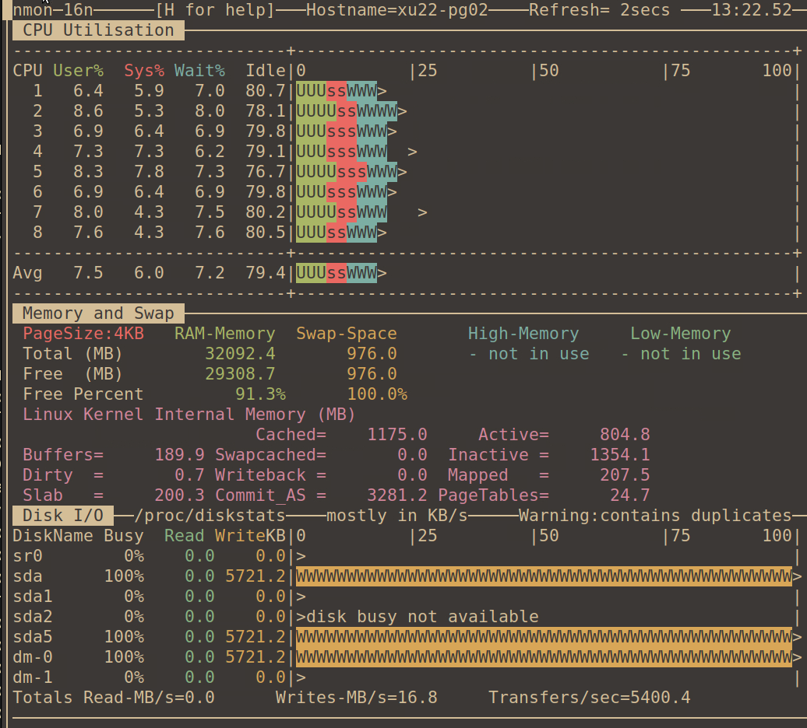

# 03. Настройка файловой системы и I/O Scheduler

### I/O scheduler

```shell
PRETTY_NAME="Ubuntu 22.04.5 LTS"
NAME="Ubuntu"
VERSION_ID="22.04"
VERSION="22.04.5 LTS (Jammy Jellyfish)"
UBUNTU_CODENAME=jammy


# uname -r
5.15.0-134-generic

# grep IOSCHED  /boot/config-5.15.0-134-generic
CONFIG_MQ_IOSCHED_DEADLINE=y
CONFIG_MQ_IOSCHED_KYBER=m
CONFIG_IOSCHED_BFQ=m
CONFIG_BFQ_GROUP_IOSCHED=y

# modprobe kyber-iosched
# modprobe bfq

# cat /etc/udev/rules.d/90-iosched.rules
ACTION=="add|change", KERNEL=="sd[a-z]", SUBSYSTEM=="block", ATTR{queue/scheduler}="none"

# cat /sys/block/sda/queue/scheduler;
[none] mq-deadline 

# cat /sys/block/sdb/queue/scheduler;
[none] mq-deadline 
```

1. **mq-deadline** [670][149.125 ms]

   <details><summary> mq-deadline</summary>

   ```
   # cat /sys/block/sda/queue/scheduler;
   [mq-deadline] kyber bfq none
   
   # su - postgres
   postgres@xu22-pg02:~$ pgbench -c 100 -j 2 -t 1000 postgres
   pgbench (17.4 (Ubuntu 17.4-1.pgdg22.04+2))
   starting vacuum...end.
   transaction type: <builtin: TPC-B (sort of)>
   scaling factor: 1
   query mode: simple
   number of clients: 100
   number of threads: 2
   maximum number of tries: 1
   number of transactions per client: 1000
   number of transactions actually processed: 100000/100000
   number of failed transactions: 0 (0.000%)
   initial connection time = 152.075 ms
   latency average = 149.125 ms
   latency average = 149.210 ms
   tps = 670.577825 (without initial connection time)
   tps = 670.196044 (without initial connection time)
   ```

   

   </details>

2. **bfq** [653][152.427 ms]

   <details><summary>bfq</summary>

   ```
   # echo bfq > /sys/block/sda/queue/scheduler
   root@xu22-pg02:/home/pilot# cat /sys/block/sda/queue/scheduler;
   mq-deadline kyber [bfq] none
   
   # su - postgres
   postgres@xu22-pg02:~$ pgbench -c 100 -j 2 -t 1000 postgres
   pgbench (17.4 (Ubuntu 17.4-1.pgdg22.04+2))
   starting vacuum...end.
   transaction type: <builtin: TPC-B (sort of)>
   scaling factor: 1
   query mode: simple
   number of clients: 100
   number of threads: 2
   maximum number of tries: 1
   number of transactions per client: 1000
   number of transactions actually processed: 100000/100000
   number of failed transactions: 0 (0.000%)
   initial connection time = 156.926 ms
   latency average = 152.427 ms
   latency average = 152.806 ms
   tps = 656.051061 (without initial connection time)
   tps = 653.446149 (without initial connection time)
   tps = 654.424243 (without initial connection time)
   ```
   

   </details>

3. **kyber** [667][149.496 ms]
   <details><summary>kyber</summary>

   ```
   # echo kyber > /sys/block/sda/queue/scheduler
   root@xu22-pg02:/home/pilot# cat /sys/block/sda/queue/scheduler;
   mq-deadline [kyber] bfq none
   
   # su - postgres
   postgres@xu22-pg02:~$ pgbench -c 100 -j 2 -t 1000 postgres
   pgbench (17.4 (Ubuntu 17.4-1.pgdg22.04+2))
   starting vacuum...end.
   transaction type: <builtin: TPC-B (sort of)>
   scaling factor: 1
   query mode: simple
   number of clients: 100
   number of threads: 2
   maximum number of tries: 1
   number of transactions per client: 1000
   number of transactions actually processed: 100000/100000
   number of failed transactions: 0 (0.000%)
   latency average = 149.743 ms
   latency average = 149.496 ms
   initial connection time = 151.143 ms
   tps = 667.810497 (without initial connection time)
   tps = 668.913972 (without initial connection time)
   ```
   

   </details>

4. **none** [671][148.914 ms]

   <details><summary>none</summary>

   ```
   # echo none > /sys/block/sda/queue/scheduler
   root@xu22-pg02:/home/pilot# cat /sys/block/sda/queue/scheduler;
   [none] mq-deadline kyber bfq 
   root@xu22-pg02:/home/pilot# su - postgres
   postgres@xu22-pg02:~$ pgbench -c 100 -j 2 -t 1000 postgres
   pgbench (17.4 (Ubuntu 17.4-1.pgdg22.04+2))
   starting vacuum...end.
   transaction type: <builtin: TPC-B (sort of)>
   scaling factor: 1
   query mode: simple
   number of clients: 100
   number of threads: 2
   maximum number of tries: 1
   number of transactions per client: 1000
   number of transactions actually processed: 100000/100000
   number of failed transactions: 0 (0.000%)
   initial connection time = 152.856 ms
   latency average = 148.914 ms
   latency average = 148.969 ms
    
    latency average = 150.733 ms
   tps = 671.529755 (without initial connection time)
   tps = 671.279097 (without initial connection time)
    tps = 664.660592 (without initial connection time)
    tps = 663.423992 (without initial connection time)
   ```
   

   </details>

5. **hdparm** [ext4]

   <details><summary>hdparm</summary>

   ```
   #!/bin/bash
   DISC="sda"; 
   cat /sys/block/$DISC/queue/scheduler;
    for T in none mq-deadline kyber bfq; do \
        echo $T > /sys/block/$DISC/queue/scheduler; \
        cat /sys/block/$DISC/queue/scheduler; \
        sync && /sbin/hdparm -tT /dev/$DISC && echo "------------------------------"; \
        sleep 15; \
    done
   ```

   - запускаем тест:
   ```
   [none] mq-deadline kyber bfq 
   /dev/sda:
    Timing cached reads:   17006 MB in  1.99 seconds = 8553.07 MB/sec
    Timing buffered disk reads: 2644 MB in  3.00 seconds = 881.00 MB/sec
   ----------------------------------------------------------------------
   
   [mq-deadline] kyber bfq none
   /dev/sda:
    Timing cached reads:   17080 MB in  1.99 seconds = 8588.89 MB/sec
    Timing buffered disk reads: 2932 MB in  3.00 seconds = 976.76 MB/sec
   ---------------------------------------------------------------------
   
   mq-deadline [kyber] bfq none
   /dev/sda:
    Timing cached reads:   17312 MB in  1.99 seconds = 8708.42 MB/sec
    Timing buffered disk reads: 2974 MB in  3.00 seconds = 991.30 MB/sec
   ---------------------------------------------------------------------
   
   mq-deadline kyber [bfq] none
   /dev/sda:
    Timing cached reads:   18478 MB in  1.99 seconds = 9298.32 MB/sec
    Timing buffered disk reads: 3126 MB in  3.00 seconds = 1041.78 MB/sec
   ----------------------------------------------------------------------
   ```

   
   
   </details>

---

### Tuning FS / OS

<details><summary>Attach new HDD into ``/pgdata`` mount as F=XFS</summary>

```shell
# lsblk 
NAME                 MAJ:MIN RM  SIZE RO TYPE MOUNTPOINTS
sda                    8:0    0   30G  0 disk 
├─sda1                 8:1    0  512M  0 part /boot/efi
├─sda2                 8:2    0    1K  0 part 
└─sda5                 8:5    0 29,5G  0 part 
  ├─vgxubuntu-root   253:1    0 28,5G  0 lvm  /var/snap/firefox/common/host-hunspell
  │                                           /
  └─vgxubuntu-swap_1 253:2    0  976M  0 lvm  [SWAP]
sdb                    8:16   0   36G  0 disk 
└─pgdata-disk0       253:0    0   20G  0 lvm  /pgdata
sr0                   11:0    1 1024M  0 rom

# sudo apt install xfsprogs
```

* Add new hdd (sdb 36G) and mount it into ``/pgdata`` as XFS FS

```shell
# mkdir /pgdata
# ssm create -s 20G -n disk0 --fstype xfs -p pgdata /dev/sdb /pgdata

----------------------------------------------------------------
Device         Free      Used      Total  Pool       Mount point
----------------------------------------------------------------
/dev/sda                        30.00 GB             PARTITIONED
/dev/sda1                      512.00 MB             /boot/efi  
/dev/sda2                        1.00 KB                        
/dev/sda5  24.00 MB  29.46 GB   29.49 GB  vgxubuntu             
/dev/sdb   16.00 GB  20.00 GB   36.00 GB  pgdata                
----------------------------------------------------------------
--------------------------------------------------------
Pool       Type  Devices      Free      Used     Total  
--------------------------------------------------------
pgdata     lvm   1        16.00 GB  20.00 GB  36.00 GB  
vgxubuntu  lvm   1        24.00 MB  29.46 GB  29.48 GB  
--------------------------------------------------------
--------------------------------------------------------------------------------------------
Volume                 Pool       Volume size  FS     FS size      Free  Type    Mount point
--------------------------------------------------------------------------------------------
/dev/vgxubuntu/root    vgxubuntu     28.51 GB  ext4  28.51 GB  13.67 GB  linear  /          
/dev/vgxubuntu/swap_1  vgxubuntu    976.00 MB                            linear             
/dev/pgdata/disk0      pgdata        20.00 GB  xfs   19.99 GB  18.07 GB  linear  /pgdata    
/dev/sda1                           512.00 MB  vfat                      part    /boot/efi  
--------------------------------------------------------------------------------------------


# mount | grep 'pgdata'
/dev/mapper/pgdata-disk0 on /pgdata type xfs (rw,noatime,attr2,inode64,logbufs=8,logbsize=32k,noquota)

# blkid /dev/mapper/pgdata-disk0
/dev/mapper/pgdata-disk0: UUID="f8451e85-4c93-47bf-911e-a35aaebc2e54" BLOCK_SIZE="512" TYPE="xfs"

# cat /etc/fstab | grep pgdata
UUID=f8451e85-4c93-47bf-911e-a35aaebc2e54 /pgdata xfs defaults,noatime 1 1
```

```shell
# ./test_io_scheduler-sdb.sh
[none] mq-deadline kyber bfq 
/dev/sdb:
 Timing cached reads:   17756 MB in  1.99 seconds = 8932.58 MB/sec
 Timing buffered disk reads: 3376 MB in  3.00 seconds = 1125.22 MB/sec
----------------------------------------------------------------------

[mq-deadline] kyber bfq none
/dev/sdb:
 Timing cached reads:   17756 MB in  1.99 seconds = 8933.23 MB/sec
 Timing buffered disk reads: 4184 MB in  3.00 seconds = 1394.17 MB/sec
----------------------------------------------------------------------

mq-deadline [kyber] bfq none
/dev/sdb:
 Timing cached reads:   17834 MB in  1.99 seconds = 8972.10 MB/sec
 Timing buffered disk reads: 4100 MB in  3.00 seconds = 1366.34 MB/sec
----------------------------------------------------------------------

mq-deadline kyber [bfq] none
/dev/sdb:
 Timing cached reads:   17760 MB in  1.99 seconds = 8934.10 MB/sec
 Timing buffered disk reads: 4588 MB in  3.00 seconds = 1528.91 MB/sec
----------------------------------------------------------------------
```
   
</details>

#### Run test again I/O Scheduler

<details><summary>set I/O Scheduler</summary>

```shell
# uname -r
5.15.0-134-generic

# grep IOSCHED  /boot/config-5.15.0-134-generic
CONFIG_MQ_IOSCHED_DEADLINE=y
CONFIG_MQ_IOSCHED_KYBER=m
CONFIG_IOSCHED_BFQ=m
CONFIG_BFQ_GROUP_IOSCHED=y

# modprobe kyber-iosched
# modprobe bfq

# cat /etc/udev/rules.d/90-iosched.rules
ACTION=="add|change", KERNEL=="sd[a-z]", SUBSYSTEM=="block", ATTR{queue/scheduler}="none"

# reboot

# cat /sys/block/sda/queue/scheduler;
[none] mq-deadline 

# cat /sys/block/sdb/queue/scheduler;
[none] mq-deadline 
```
   
</details>

1. **mq-deadline XFS [885][112.927ms]**

<details><summary>mq-deadline XFS</summary>

```shell
# cat /sys/block/sdb/queue/scheduler;
[mq-deadline] kyber bfq none

root@xu22-pg02:/home/pilot# su - postgres
postgres@xu22-pg02:~$ pgbench -c 100 -j 2 -t 1000 postgres
pgbench (17.4 (Ubuntu 17.4-1.pgdg22.04+2))
starting vacuum...end.
transaction type: <builtin: TPC-B (sort of)>
scaling factor: 1
query mode: simple
number of clients: 100
number of threads: 2
maximum number of tries: 1
number of transactions per client: 1000
number of transactions actually processed: 100000/100000
number of failed transactions: 0 (0.000%)
latency average = 112.927 ms
initial connection time = 173.852 ms
tps = 885.524690 (without initial connection time)
```


</details>

2. **kyber XFS [891][112.159 ms]**

<details><summary>kyber XFS</summary>

```
# cat /sys/block/sdb/queue/scheduler;
mq-deadline [kyber] bfq none
root@xu22-pg02:/home/pilot# su - postgres
postgres@xu22-pg02:~$ pgbench -c 100 -j 2 -t 1000 postgres
pgbench (17.4 (Ubuntu 17.4-1.pgdg22.04+2))
starting vacuum...end.
transaction type: <builtin: TPC-B (sort of)>
scaling factor: 1
query mode: simple
number of clients: 100
number of threads: 2
maximum number of tries: 1
number of transactions per client: 1000
number of transactions actually processed: 100000/100000
number of failed transactions: 0 (0.000%)
latency average = 112.159 ms
initial connection time = 170.893 ms
tps = 891.594319 (without initial connection time)
```


</details>

3. **BFQ XFS [870][114.826 ms]**

<details><summary>bfq XFS</summary>

```
# echo bfq > /sys/block/sdb/queue/scheduler;
root@xu22-pg02:/home/pilot# cat /sys/block/sdb/queue/scheduler;
mq-deadline kyber [bfq] none
root@xu22-pg02:/home/pilot# su - postgres
postgres@xu22-pg02:~$ pgbench -c 100 -j 2 -t 1000 postgres
pgbench (17.4 (Ubuntu 17.4-1.pgdg22.04+2))
starting vacuum...end.
transaction type: <builtin: TPC-B (sort of)>
scaling factor: 1
query mode: simple
number of clients: 100
number of threads: 2
maximum number of tries: 1
number of transactions per client: 1000
number of transactions actually processed: 100000/100000
number of failed transactions: 0 (0.000%)
latency average = 114.826 ms
initial connection time = 174.605 ms
tps = 870.879602 (without initial connection time)
```


</details>

4. **NONE XFS [902][110.749ms]**

<details><summary>none XFS</summary>

```
# echo none > /sys/block/sdb/queue/scheduler;
root@xu22-pg02:/home/pilot# cat /sys/block/sdb/queue/scheduler;
[none] mq-deadline kyber bfq 
root@xu22-pg02:/home/pilot# su - postgres
postgres@xu22-pg02:~$ pgbench -c 100 -j 2 -t 1000 postgres
pgbench (17.4 (Ubuntu 17.4-1.pgdg22.04+2))
starting vacuum...end.
transaction type: <builtin: TPC-B (sort of)>
scaling factor: 1
query mode: simple
number of clients: 100
number of threads: 2
maximum number of tries: 1
number of transactions per client: 1000
number of transactions actually processed: 100000/100000
number of failed transactions: 0 (0.000%)
latency average = 110.749 ms
initial connection time = 171.108 ms
tps = 902.943269 (without initial connection time)
```


</details>

---

1. Test for SELECT random
   <details><summary> create load profile (read): </summary>

   ```shell
   cat > workload_r.sql << 'EOL'
   \set r random(1, 6000000) 
   SELECT id, fkRide, fio, contact, fkSeat FROM book.tickets WHERE id = :r;
   EOL
   ```

   </details>

   <details><summary> run test: </summary>

   ```shell
   pgbench -c 10 -j 4 -T 10 -f ./workload_r.sql -n -h 127.0.0.1 -p 5432 -U postgres thai
   pgbench (17.4 (Ubuntu 17.4-1.pgdg22.04+2))
   transaction type: ./workload_r.sql
   scaling factor: 1
   query mode: simple
   number of clients: 10
   number of threads: 4
   maximum number of tries: 1
   duration: 10 s
   number of transactions actually processed: 297970
   number of failed transactions: 0 (0.000%)
   latency average = 0.333 ms
   initial connection time = 98.611 ms
   tps = 30017.693081 (without initial connection time)
   ```

   </details>

   tps = 30017.693081
   latency average = 0.333 ms

2. Test for WRITE

   <details><summary> create load profile (write): </summary>

   ```shell
   cat > ./workload_w.sql << 'EOL'
   INSERT INTO book.tickets (fkRide, fio, contact, fkSeat)
   VALUES (
   	ceil(random()*100)
   	, (array(SELECT fam FROM book.fam))[ceil(random()*110)]::text || ' ' ||
       (array(SELECT nam FROM book.nam))[ceil(random()*110)]::text
       ,('{"phone":"+7' || (1000000000::bigint + floor(random()*9000000000)::bigint)::text || '"}')::jsonb
       , ceil(random()*100));
   EOL
   ```

   </details>

   <details><summary> run test (write): </summary>

   ```shell
   thai=# SELECT pg_size_pretty(pg_total_relation_size('"book"."tickets"'));
    pg_size_pretty 
   ----------------
    5952 MB
   (1 строка)
   
   $ pgbench -c 10 -j 4 -T 10 -f ./workload_w.sql -n -h 127.0.0.1 -p 5432 -U postgres thai
   pgbench (17.4 (Ubuntu 17.4-1.pgdg22.04+2))
   transaction type: ./workload_w.sql
   scaling factor: 1
   query mode: simple
   number of clients: 10
   number of threads: 4
   maximum number of tries: 1
   duration: 10 s
   number of transactions actually processed: 57245
   number of failed transactions: 0 (0.000%)
   latency average = 1.729 ms
   initial connection time = 103.042 ms
   tps = 5782.701736 (without initial connection time)

   thai=# SELECT pg_size_pretty(pg_total_relation_size('"book"."tickets"'));
    pg_size_pretty 
   ----------------
    5958 MB
   (1 строка)

    SELECT t1.datname AS db_name,
           pg_size_pretty(pg_database_size(t1.datname)) AS db_size
    FROM pg_database t1
    ORDER BY pg_database_size(t1.datname) DESC;

      db_name  | db_size 
    -----------+---------
     thai      | 6062 MB
     postgres  | 32 MB
     template1 | 7563 kB
     template0 | 7337 kB
    (4 строки)

    thai=# SELECT pg_size_pretty(pg_total_relation_size('"pg_catalog"."pg_class"'));
    pg_size_pretty 
   ----------------
    232 kB
   (1 строка)
   
   thai=# SELECT pg_size_pretty(pg_total_relation_size('"pg_catalog"."pg_attribute"'));
    pg_size_pretty 
   ----------------
    728 kB
   (1 строка)
   ```

   </details>

   tps = 5782.701736
   latency average = 1.729 ms

---

### Move PG_WAL into separate HDD mounted as XFS 

   <details><summary>Add sdc drive</summary>

   ```shell
   # lsblk
   NAME                 MAJ:MIN RM  SIZE RO TYPE MOUNTPOINTS
   sda                    8:0    0   30G  0 disk 
   ├─sda1                 8:1    0  512M  0 part /boot/efi
   ├─sda2                 8:2    0    1K  0 part 
   └─sda5                 8:5    0 29,5G  0 part 
     ├─vgxubuntu-root   253:1    0 28,5G  0 lvm  /var/snap/firefox/common/host-hunspell
     │                                           /
     └─vgxubuntu-swap_1 253:2    0  976M  0 lvm  [SWAP]
   sdb                    8:16   0   36G  0 disk 
   └─pgdata-disk0       253:0    0   20G  0 lvm  /pgdata
   sdc                    8:32   0   16G  0 disk 
   sr0                   11:0    1 1024M  0 rom  
   
   # mkdir /pgdata/pg_wal
   # chown -R postgres:postgres /pgdata/pg_wal
   
   # ./ssm.local create -s 8G -n disk0 --fstype xfs -p pgwal /dev/sdc /pgdata/pg_wal
     Physical volume "/dev/sdc" successfully created.
     Volume group "pgwal" successfully created
     Logical volume "disk0" created.
   meta-data=/dev/pgwal/disk0       isize=512    agcount=4, agsize=524288 blks
            =                       sectsz=512   attr=2, projid32bit=1
            =                       crc=1        finobt=1, sparse=1, rmapbt=0
            =                       reflink=1    bigtime=0 inobtcount=0
   data     =                       bsize=4096   blocks=2097152, imaxpct=25
            =                       sunit=0      swidth=0 blks
   naming   =version 2              bsize=4096   ascii-ci=0, ftype=1
   log      =internal log           bsize=4096   blocks=2560, version=2
            =                       sectsz=512   sunit=0 blks, lazy-count=1
   realtime =none                   extsz=4096   blocks=0, rtextents=0
   #--------------------------------------------------------------------------------------
   
   # mount | grep 'pgwal'
   /dev/mapper/pgwal-disk0 on /pgdata/pg_wal type xfs (rw,relatime,attr2,inode64,logbufs=8,logbsize=32k,noquota)
   
   # blkid /dev/mapper/pgwal-disk0
   /dev/mapper/pgwal-disk0: UUID="d4d8f120-5aae-4eb3-91ee-26f4a1989474" BLOCK_SIZE="512" TYPE="xfs"
   
   # # cat /etc/fstab | grep pg_wal
   UUID=d4d8f120-5aae-4eb3-91ee-26f4a1989474 /pgdata/pg_wal    xfs defaults,noatime 1 1
   
   # sudo systemctl daemon-reload; umount /pgdata/pg_wal; mount /pgdata/pg_wal; mount | grep pgdata
   /dev/mapper/pgdata-disk0 on /pgdata type xfs (rw,noatime,attr2,inode64,logbufs=8,logbsize=32k,noquota)
   /dev/mapper/pgwal-disk0 on /pgdata/pg_wal type xfs (rw,noatime,attr2,inode64,logbufs=8,logbsize=32k,noquota)
   ```

   </details>


   <details><summary>Move WAL Directory into new place</summary>

   ```shell
   # mkdir -p /pgdata/pg_wal/17/main
   # chown -R postgres:postgres /pgdata/pg_wal
   
   # pg_lsclusters 
   Ver Cluster Port Status Owner    Data directory             Log file
   17  main    5432 down   postgres /pgdata/postgresql/17/main /var/log/postgresql/postgresql-17-main.log
   
   # mv /pgdata/postgresql/17/main/pg_wal /pgdata/pg_wal/17/main/
   # ll /pgdata/pg_wal/17/main/
   итого 4
   drwxr-xr-x 3 postgres postgres   20 мар 23 21:41 ./
   drwxr-xr-x 3 postgres postgres   18 мар 23 21:40 ../
   drwx------ 4 postgres postgres 4096 мар 23 18:16 pg_wal/
   
   
   # ln -s /pgdata/pg_wal/17/main/pg_wal /pgdata/postgresql/17/main/pg_wal
   
   # ll /pgdata/postgresql/17/main/
   итого 20
   drwx------ 18 postgres postgres 4096 мар 23 21:44 ./
   drwxr-xr-x  3 postgres postgres   18 фев  9 22:18 ../
   drwx------  7 postgres postgres   63 мар 23 15:57 base/
   drwx------  2 postgres postgres 4096 мар 23 21:21 global/
   drwx------  2 postgres postgres    6 фев  9 22:18 pg_commit_ts/
   drwx------  2 postgres postgres    6 фев  9 22:18 pg_dynshmem/
   drwx------  4 postgres postgres   68 мар 23 21:24 pg_logical/
   drwx------  4 postgres postgres   36 фев  9 22:18 pg_multixact/
   drwx------  2 postgres postgres    6 фев  9 22:18 pg_notify/
   drwx------  2 postgres postgres    6 фев  9 22:18 pg_replslot/
   drwx------  2 postgres postgres    6 фев  9 22:18 pg_serial/
   drwx------  2 postgres postgres    6 фев  9 22:18 pg_snapshots/
   drwx------  2 postgres postgres   56 мар 23 21:24 pg_stat/
   drwx------  2 postgres postgres    6 мар 23 21:24 pg_stat_tmp/
   drwx------  2 postgres postgres   18 мар 23 01:55 pg_subtrans/
   drwx------  2 postgres postgres    6 фев  9 22:18 pg_tblspc/
   drwx------  2 postgres postgres    6 фев  9 22:18 pg_twophase/
   -rw-------  1 postgres postgres    3 фев  9 22:18 PG_VERSION
   lrwxrwxrwx  1 root     root       29 мар 23 21:44 pg_wal -> /pgdata/pg_wal/17/main/pg_wal/
   drwx------  2 postgres postgres   42 мар 23 02:04 pg_xact/
   -rw-------  1 postgres postgres   88 фев  9 22:18 postgresql.auto.conf
   -rw-------  1 postgres postgres  129 мар 23 21:20 postmaster.opts
   
   # ll /pgdata/pg_wal/17/main/
   итого 4
   drwxr-xr-x 3 postgres postgres   20 мар 23 21:41 ./
   drwxr-xr-x 3 postgres postgres   18 мар 23 21:40 ../
   drwx------ 4 postgres postgres 4096 мар 23 18:16 pg_wal/
   
   # ll /pgdata/pg_wal/17/main/pg_wal/ | head -n4
   итого 1015812
   drwx------ 4 postgres postgres     4096 мар 23 18:16 ./
   drwxr-xr-x 3 postgres postgres       20 мар 23 21:41 ../
   -rw------- 1 postgres postgres 16777216 мар 23 21:24 00000001000000010000009D
   #--------------------------------------------------------------------------------------
   
   # systemctl start postgresql
   # systemctl status postgresql
   ● postgresql.service - PostgreSQL RDBMS
        Loaded: loaded (/lib/systemd/system/postgresql.service; enabled; vendor preset: enabled)
        Active: active (exited) since Sun 2025-03-23 21:46:37 MSK; 4s ago
       Process: 1701 ExecStart=/bin/true (code=exited, status=0/SUCCESS)
      Main PID: 1701 (code=exited, status=0/SUCCESS)
           CPU: 2ms
   
   мар 23 21:46:37 xu22-pg02 systemd[1]: Starting PostgreSQL RDBMS...
   мар 23 21:46:37 xu22-pg02 systemd[1]: Finished PostgreSQL RDBMS.
   
   # pg_lsclusters 
   Ver Cluster Port Status Owner    Data directory             Log file
   17  main    5432 online postgres /pgdata/postgresql/17/main /var/log/postgresql/postgresql-17-main.log
   ```

   </details>

#### Test for READ

   <details><summary>first (DB not in memory)</summary>

   ```shell
   $ pgbench -c 10 -j 4 -T 10 -f ./workload_r.sql -n -h 127.0.0.1 -p 5432 -U postgres thai
   pgbench (17.4 (Ubuntu 17.4-1.pgdg22.04+2))
   transaction type: ./workload_r.sql
   scaling factor: 1
   query mode: simple
   number of clients: 10
   number of threads: 4
   maximum number of tries: 1
   duration: 10 s
   number of transactions actually processed: 229906
   number of failed transactions: 0 (0.000%)
   latency average = 0.431 ms
   initial connection time = 98.783 ms
   tps = 23175.652954 (without initial connection time)
   ```
   

   </details>

   **tps = 23175.652954**

   <details><summary>second (DB is in memory)</summary>

   ```
   pilot@xu22-pg02:~/PG-OPT31/Ex.03$ pgbench -c 10 -j 4 -T 20 -f ./workload_r.sql -n -h 127.0.0.1 -p 5432 -U postgres thai
   pgbench (17.4 (Ubuntu 17.4-1.pgdg22.04+2))
   transaction type: ./workload_r.sql
   scaling factor: 1
   query mode: simple
   number of clients: 10
   number of threads: 4
   maximum number of tries: 1
   duration: 20 s
   number of transactions actually processed: 621913
   number of failed transactions: 0 (0.000%)
   latency average = 0.320 ms
   initial connection time = 103.296 ms
   tps = 31240.678602 (without initial connection time)
   ```
   

   </details>

   **tps = 31240.678602**

#### Test for WRITE

   <details><summary>OnWrite test result</summary>

   ```shell
   $ pgbench -c 10 -j 4 -T 20 -f ./workload_w.sql -n -h 127.0.0.1 -p 5432 -U postgres thai
   pgbench (17.4 (Ubuntu 17.4-1.pgdg22.04+2))
   transaction type: ./workload_w.sql
   scaling factor: 1
   query mode: simple
   number of clients: 10
   number of threads: 4
   maximum number of tries: 1
   duration: 20 s
   number of transactions actually processed: 115056
   number of failed transactions: 0 (0.000%)
   latency average = 1.730 ms
   initial connection time = 103.727 ms
   tps = 5780.272479 (without initial connection time)


   $ df -h | grep pgdata
     /dev/mapper/pgdata-disk0      20G         7,2G   13G           36% /pgdata
     /dev/mapper/pgwal-disk0      8,0G         1,1G  7,0G           13% /pgdata/pg_wal
   ```
   
   
   </details>

   **tps = 5780.272479**
   
   Видимо, поскольку все диски этой виртуалки живут на "хостовой" машине (гипервизоре) 
   на одном разделе, достичь высокой производительности в данном случае не получится.
   Хотя, диски там SSD и в целом, загрузка показывается не очень высокая (менее 30%). Может и VirtualBox виноват...

   
   
----
##### Выполним создание таблицы ``tickets1`` и её заполнение на основе ``tickets``

<details><summary>Создадим новую таблицу ``tickets1``</summary>

```sql
postgres@thai=# set search_path='book';
SET
Время: 0,893 мс
postgres@thai=# set work_mem='8GB';
SET
Время: 0,597 мс
postgres@thai=# vacuum full tickets;
VACUUM
Время: 212225,881 мс (03:32,226)

-------------------------------------------------------------------------------
postgres@thai=# 
explain
select t.id, t.fkride, t.fio, t.contact, t.fkseat, r.startdate
into tickets1
from tickets t
join ride r
    on r.id=t.fkride;
                                  QUERY PLAN                                   
-------------------------------------------------------------------------------
 Hash Join  (cost=41910.00..1348257.19 rows=54457092 width=65)
   Hash Cond: (t.fkride = r.id)
   ->  Seq Scan on tickets t  (cost=0.00..1163396.92 rows=54457092 width=61)
   ->  Hash  (cost=23160.00..23160.00 rows=1500000 width=8)
         ->  Seq Scan on ride r  (cost=0.00..23160.00 rows=1500000 width=8)
 JIT:
   Functions: 11
   Options: Inlining true, Optimization true, Expressions true, Deforming true
(8 строк)
Время: 1,971 мс


-------------------------------------------------------------------------------
postgres@thai=# \i biggest_tables.sql
         relation         | total_size 
--------------------------+------------
 book.tickets             | 6001 MB
 book.ride                | 96 MB
 book.schedule            | 184 kB
 book.seat                | 56 kB
 book.seatcategory        | 32 kB
 book.bus                 | 32 kB
 book.busstation          | 32 kB
 book.busroute            | 24 kB
 book.fam                 | 16 kB
 book.nam                 | 16 kB
 book.seatcategory_id_seq | 8192 bytes
 book.ride_id_seq         | 8192 bytes
 book.bus_id_seq          | 8192 bytes
 book.busstation_id_seq   | 8192 bytes
 book.busroute_id_seq     | 8192 bytes
 book.tickets_id_seq      | 8192 bytes
 book.schedule_id_seq     | 8192 bytes
 book.seat_id_seq         | 8192 bytes
(18 строк)


postgres@thai=# \! df -h | grep pgdata
/dev/mapper/pgdata-disk0      20G         6,2G   14G           31% /pgdata
/dev/mapper/pgwal-disk0      8,0G         954M  7,1G           12% /pgdata/pg_wal
---------------------------------------------------------------------------------

# Создаём таблицу tickets1
postgres@thai=# 
select t.id, t.fkride, t.fio, t.contact, t.fkseat, r.startdate
into tickets1
from tickets t
join ride r
    on r.id=t.fkride;
SELECT 54457092
Время: 92350,304 мс (01:32,350)

---------------------------------------------------------------------------------
postgres@thai=# \! df -h | grep pgdata
/dev/mapper/pgdata-disk0      20G          12G  8,9G           56% /pgdata
/dev/mapper/pgwal-disk0      8,0G         1,1G  7,0G           14% /pgdata/pg_wal
---------------------------------------------------------------------------------

postgres@thai=# \i biggest_tables.sql
         relation         | total_size 
--------------------------+------------
 book.tickets             | 6001 MB
 book.tickets1            | 5117 MB

postgres@thai=# select min(startdate), max(startdate) from tickets1;
    min     |    max     
------------+------------
 2000-01-01 | 2002-09-26
(1 строка)
Время: 3701,102 мс (00:03,701)

postgres@thai=# vacuum analyze tickets1;
VACUUM
Время: 6317,764 мс (00:06,318)

postgres@thai=# select min(startdate), max(startdate) from tickets1;
    min     |    max     
------------+------------
 2000-01-01 | 2002-09-26
(1 строка)
Время: 1481,583 мс (00:01,482)
```

</details>

##### Выполним для сравнения обновление на текущей таблице ``tickets``

<details><summary>Обновим таблицу ``tickets``</summary>

```sql
# добавим поле startdate в ``tickets``
postgres@thai=# alter table tickets add startdate date;

# Посмотрим план 
explain
update tickets t 
set startdate=r.startdate
from ride r 
where r.id = t.fkride;
                                    QUERY PLAN                                     
-----------------------------------------------------------------------------------
 Update on tickets t  (cost=41910.00..1348257.19 rows=0 width=0)
   ->  Hash Join  (cost=41910.00..1348257.19 rows=54457092 width=16)
         Hash Cond: (t.fkride = r.id)
         ->  Seq Scan on tickets t  (cost=0.00..1163396.92 rows=54457092 width=10)
         ->  Hash  (cost=23160.00..23160.00 rows=1500000 width=14)
               ->  Seq Scan on ride r  (cost=0.00..23160.00 rows=1500000 width=14)
 JIT:
   Functions: 10
   Options: Inlining true, Optimization true, Expressions true, Deforming true
(9 строк)
Время: 3,579 мс
#----------------------------------------------------------------------------------

# Выполним обновление:
UPDATE tickets t
SET startdate=r.startdate
FROM ride r
WHERE r.id = t.fkride;

UPDATE 54457092
Время: 551427,637 мс (09:11,428)
#---------------------------------------------------------------------------------------------------------------------------------------------------------

postgres@thai=# \d+ tickets
                                                                  Таблица "book.tickets"
  Столбец  |   Тип   | Правило сортировки | Допустимость NULL |            По умолчанию             | Хранилище | Сжатие | Цель для статистики | Описание 
-----------+---------+--------------------+-------------------+-------------------------------------+-----------+--------+---------------------+----------
 id        | bigint  |                    | not null          | nextval('tickets_id_seq'::regclass) | plain     |        |                     | 
 fkride    | integer |                    |                   |                                     | plain     |        |                     | 
 fio       | text    |                    |                   |                                     | extended  |        |                     | 
 contact   | jsonb   |                    |                   |                                     | extended  |        |                     | 
 fkseat    | integer |                    |                   |                                     | plain     |        |                     | 
 startdate | date    |                    |                   |                                     | plain     |        |                     | 
Индексы:
    "tickets_pkey" PRIMARY KEY, btree (id)
Ограничения внешнего ключа:
    "tickets_fkride_fkey" FOREIGN KEY (fkride) REFERENCES ride(id)
    "tickets_fkseat_fkey" FOREIGN KEY (fkseat) REFERENCES seat(id)
Метод доступа: heap

postgres@thai=# select min(startdate), max(startdate) from tickets;
    min     |    max     
------------+------------
 2000-01-01 | 2002-09-26
(1 строка)
Время: 4303,421 мс (00:04,303)
```

</details>

<details><summary>Напишем функцию, для партицирования (создания) ``tickets_part``</summary>

```sql
DO $$
DECLARE 
v_min_date date;
v_max_date date;
v_cur_date date;
v_sql_stmt text;
c_main_table_name varchar(50) = 'tickets_part';
begin
	v_sql_stmt = 'create table '|| quote_ident(c_main_table_name) ||' (like tickets) partition by range (startdate)';
	execute v_sql_stmt;
	v_sql_stmt = 'create table default_partition_'|| quote_ident(c_main_table_name) ||' partition of '|| quote_ident(c_main_table_name) || ' default';
	execute v_sql_stmt;
	select date_trunc('month', min(startdate)), date_trunc('month', max(startdate)) + interval '1 month'
	into v_min_date, v_max_date
	from tickets;
	v_cur_date = v_min_date;
	loop
    	v_sql_stmt = 'create table ' || quote_ident(c_main_table_name || '_' || to_char(v_cur_date, 'yyyy_mm')) || ' partition of '
    	|| quote_ident(c_main_table_name) || ' for values from (''' || 
    	to_char(v_cur_date, 'yyyy-mm-dd')|| ''') to (''' || to_char(v_cur_date+ interval '1 month', 'yyyy-mm-dd')|| ''')';
    	IF v_cur_date >= v_max_date THEN
        	EXIT;
    	END IF;
    	execute v_sql_stmt;
    	--raise notice '%', v_sql_stmt;
    	v_cur_date = v_cur_date + interval '1 month';
	END LOOP;

end $$;
DO
Время: 6707,540 мс (00:06,708)
```

</details>

<details><summary>Проверим, что получилось для ``tickets_part`` (партиции)</summary>


```sql
postgres@thai=# \dt
                               Список отношений
 Схема |              Имя               |           Тип            | Владелец 
-------+--------------------------------+--------------------------+----------
 book  | bus                            | таблица                  | postgres
 book  | busroute                       | таблица                  | postgres
 book  | busstation                     | таблица                  | postgres
 book  | default_partition_tickets_part | таблица                  | postgres
 book  | fam                            | таблица                  | postgres
 book  | nam                            | таблица                  | postgres
 book  | ride                           | таблица                  | postgres
 book  | schedule                       | таблица                  | postgres
 book  | seat                           | таблица                  | postgres
 book  | seatcategory                   | таблица                  | postgres
 book  | tickets                        | таблица                  | postgres
 book  | tickets_part                   | секционированная таблица | postgres
 book  | tickets_part_2000_01           | таблица                  | postgres
 book  | tickets_part_2000_02           | таблица                  | postgres
 book  | tickets_part_2000_03           | таблица                  | postgres
 book  | tickets_part_2000_04           | таблица                  | postgres
 book  | tickets_part_2000_05           | таблица                  | postgres
 book  | tickets_part_2000_06           | таблица                  | postgres
 book  | tickets_part_2000_07           | таблица                  | postgres
 book  | tickets_part_2000_08           | таблица                  | postgres
 book  | tickets_part_2000_09           | таблица                  | postgres
 book  | tickets_part_2000_10           | таблица                  | postgres
 book  | tickets_part_2000_11           | таблица                  | postgres
 book  | tickets_part_2000_12           | таблица                  | postgres
 book  | tickets_part_2001_01           | таблица                  | postgres
 book  | tickets_part_2001_02           | таблица                  | postgres
 book  | tickets_part_2001_03           | таблица                  | postgres
 book  | tickets_part_2001_04           | таблица                  | postgres
 book  | tickets_part_2001_05           | таблица                  | postgres
 book  | tickets_part_2001_06           | таблица                  | postgres
 book  | tickets_part_2001_07           | таблица                  | postgres
 book  | tickets_part_2001_08           | таблица                  | postgres
 book  | tickets_part_2001_09           | таблица                  | postgres
 book  | tickets_part_2001_10           | таблица                  | postgres
 book  | tickets_part_2001_11           | таблица                  | postgres
 book  | tickets_part_2001_12           | таблица                  | postgres
 book  | tickets_part_2002_01           | таблица                  | postgres
 book  | tickets_part_2002_02           | таблица                  | postgres
 book  | tickets_part_2002_03           | таблица                  | postgres
 book  | tickets_part_2002_04           | таблица                  | postgres
 book  | tickets_part_2002_05           | таблица                  | postgres
 book  | tickets_part_2002_06           | таблица                  | postgres
 book  | tickets_part_2002_07           | таблица                  | postgres
 book  | tickets_part_2002_08           | таблица                  | postgres
 book  | tickets_part_2002_09           | таблица                  | postgres
```

</details>

<details><summary>Переливаем данные из обычной таблицы ``tickets`` в партицированную ``tickets_part``</summary>

```sql
postgres@thai-# EXPLAIN INSERT INTO tickets_part SELECT * FROM tickets;
                                QUERY PLAN                                 
---------------------------------------------------------------------------
 Insert on tickets_part  (cost=0.00..1819904.56 rows=0 width=0)
   ->  Seq Scan on tickets  (cost=0.00..1819904.56 rows=54628956 width=65)
(2 строки)
Время: 1,687 мс

postgres@thai=# INSERT INTO tickets_part SELECT * FROM tickets;
INSERT 0 54457092
Время: 90950,389 мс (01:30,950)

postgres@thai=# \i biggest_tables.sql
         relation          | total_size 
---------------------------+------------
 book.tickets              | 12 GB
 book.tickets_part_2000_01 | 201 MB
 book.tickets_part_2001_03 | 157 MB
 book.tickets_part_2001_08 | 157 MB
 book.tickets_part_2000_05 | 157 MB
 book.tickets_part_2000_10 | 157 MB
 book.tickets_part_2000_03 | 157 MB
 book.tickets_part_2002_01 | 157 MB
 book.tickets_part_2001_12 | 157 MB
 book.tickets_part_2002_05 | 157 MB
 book.tickets_part_2001_10 | 157 MB
 book.tickets_part_2002_03 | 157 MB
 book.tickets_part_2000_12 | 157 MB
 book.tickets_part_2001_01 | 157 MB
 book.tickets_part_2002_07 | 157 MB
 book.tickets_part_2000_08 | 157 MB
 book.tickets_part_2001_05 | 157 MB
 book.tickets_part_2000_07 | 157 MB
 book.tickets_part_2002_08 | 157 MB
 book.tickets_part_2001_07 | 157 MB
(20 строк)
Время: 5,517 мс
```

</details>

---

#### Tests

<details><summary>Из 1 секции</summary>

```sql
postgres@thai=# explain analyze
select * from tickets where startdate = '20010101';
                                                             QUERY PLAN                                                              
-------------------------------------------------------------------------------------------------------------------------------------
 Gather  (cost=1000.00..1453342.69 rows=80122 width=65) (actual time=176.869..2122.648 rows=54005 loops=1)
   Workers Planned: 4
   Workers Launched: 4
   ->  Parallel Seq Scan on tickets  (cost=0.00..1444330.49 rows=20030 width=65) (actual time=317.730..1814.278 rows=10801 loops=5)
         Filter: (startdate = '2001-01-01'::date)
         Rows Removed by Filter: 10880617
 Planning Time: 0.139 ms
 JIT:
   Functions: 10
   Options: Inlining true, Optimization true, Expressions true, Deforming true
   Timing: Generation 2.829 ms (Deform 0.831 ms), Inlining 451.768 ms, Optimization 151.403 ms, Emission 86.582 ms, Total 692.582 ms
 Execution Time: 2125.392 ms
(12 строк)
Время: 2126,609 мс (00:02,127)

postgres@thai=# explain analyze
select * from tickets_part where startdate = '20010101';
                                                                       QUERY PLAN                                                                       
--------------------------------------------------------------------------------------------------------------------------------------------------------
 Gather  (cost=1000.00..33180.90 rows=53005 width=65) (actual time=0.592..106.055 rows=54005 loops=1)
   Workers Planned: 3
   Workers Launched: 3
   ->  Parallel Seq Scan on tickets_part_2001_01 tickets_part  (cost=0.00..26880.40 rows=17098 width=65) (actual time=1.899..60.527 rows=13501 loops=4)
         Filter: (startdate = '2001-01-01'::date)
         Rows Removed by Filter: 404961
 Planning Time: 0.353 ms
 Execution Time: 108.213 ms
(8 строк)
Время: 109,411 мс
```

</details>

*  **from tickets:**
   Planning Time: 0.139 ms
   Execution Time: 2125.392 ms
*  **from tickets_part:**
   Planning Time: 0.353 ms
   Execution Time: 108.213 ms

<details><summary>Из 2 секций</summary>

```sql
explain analyze
select * from tickets where startdate = '20010101' or startdate = '20020201';
                                                             QUERY PLAN                                                              
-------------------------------------------------------------------------------------------------------------------------------------
 Gather  (cost=1000.00..1492740.08 rows=132665 width=65) (actual time=165.261..2054.339 rows=107982 loops=1)
   Workers Planned: 4
   Workers Launched: 4
   ->  Parallel Seq Scan on tickets  (cost=0.00..1478473.58 rows=33166 width=65) (actual time=220.331..1716.066 rows=21596 loops=5)
         Filter: ((startdate = '2001-01-01'::date) OR (startdate = '2002-02-01'::date))
         Rows Removed by Filter: 10869822
 Planning Time: 0.114 ms
 JIT:
   Functions: 10
   Options: Inlining true, Optimization true, Expressions true, Deforming true
   Timing: Generation 2.503 ms (Deform 0.871 ms), Inlining 411.783 ms, Optimization 207.074 ms, Emission 91.336 ms, Total 712.696 ms
 Execution Time: 2059.398 ms
(12 строк)
Время: 2060,586 мс (00:02,061)

explain analyze
select * from tickets_part where startdate = '20010101' or startdate = '20020201';
                                                                           QUERY PLAN                                                                            
-----------------------------------------------------------------------------------------------------------------------------------------------------------------
 Gather  (cost=1000.00..65968.19 rows=110604 width=65) (actual time=0.515..170.597 rows=107982 loops=1)
   Workers Planned: 3
   Workers Launched: 3
   ->  Parallel Append  (cost=0.00..53907.79 rows=35678 width=65) (actual time=1.506..122.537 rows=26996 loops=4)
         ->  Parallel Seq Scan on tickets_part_2001_01 tickets_part_1  (cost=0.00..28230.27 rows=17098 width=65) (actual time=2.179..67.492 rows=13501 loops=4)
               Filter: ((startdate = '2001-01-01'::date) OR (startdate = '2002-02-01'::date))
               Rows Removed by Filter: 404961
         ->  Parallel Seq Scan on tickets_part_2002_02 tickets_part_2  (cost=0.00..25499.12 rows=18580 width=65) (actual time=0.550..105.896 rows=26988 loops=2)
               Filter: ((startdate = '2001-01-01'::date) OR (startdate = '2002-02-01'::date))
               Rows Removed by Filter: 728908
 Planning Time: 0.351 ms
 Execution Time: 174.828 ms
(12 строк)
Время: 175,968 мс
```

</details>

*  **from tickets:**
   Planning Time: 0.114 ms
   Execution Time: 2059.398 ms
*  **from tickets_part:**
   Planning Time: 0.351 ms
   Execution Time: 174.828 ms

<details><summary>Диапазон</summary>

```sql
explain analyze
select * from tickets where startdate > '20010101' and startdate < '20010202';
                                                              QUERY PLAN                                                              
--------------------------------------------------------------------------------------------------------------------------------------
 Gather  (cost=1000.00..1658253.98 rows=1787804 width=65) (actual time=69.121..2389.989 rows=1673895 loops=1)
   Workers Planned: 4
   Workers Launched: 4
   ->  Parallel Seq Scan on tickets  (cost=0.00..1478473.58 rows=446951 width=65) (actual time=138.159..1694.479 rows=334779 loops=5)
         Filter: ((startdate > '2001-01-01'::date) AND (startdate < '2001-02-02'::date))
         Rows Removed by Filter: 10556639
 Planning Time: 0.174 ms
 JIT:
   Functions: 10
   Options: Inlining true, Optimization true, Expressions true, Deforming true
   Timing: Generation 2.369 ms (Deform 0.893 ms), Inlining 359.937 ms, Optimization 150.675 ms, Emission 86.411 ms, Total 599.392 ms
 Execution Time: 2456.112 ms
(12 строк)
Время: 2457,262 мс (00:02,457)

explain analyze
select * from tickets_part where startdate > '20010101' and startdate < '20010202';
                                                                      QUERY PLAN                                                                      
------------------------------------------------------------------------------------------------------------------------------------------------------
 Append  (cost=0.00..94491.74 rows=1675793 width=65) (actual time=0.021..562.098 rows=1673895 loops=1)
   ->  Seq Scan on tickets_part_2001_01 tickets_part_1  (cost=0.00..45238.75 rows=1620845 width=65) (actual time=0.020..269.923 rows=1619845 loops=1)
         Filter: ((startdate > '2001-01-01'::date) AND (startdate < '2001-02-02'::date))
         Rows Removed by Filter: 54005
   ->  Seq Scan on tickets_part_2001_02 tickets_part_2  (cost=0.00..40874.02 rows=54948 width=65) (actual time=0.021..174.403 rows=54050 loops=1)
         Filter: ((startdate > '2001-01-01'::date) AND (startdate < '2001-02-02'::date))
         Rows Removed by Filter: 1458285
 Planning Time: 0.436 ms
 Execution Time: 623.645 ms
(9 строк)
Время: 624,923 мс
```

</details>

*  **from tickets:**
   Planning Time: 0.174 ms
   Execution Time: 2456.112 ms 
*  **from tickets_part:**
   Planning Time: 0.436 ms
   Execution Time: 623.645 ms

<details><summary>Все секции</summary>

```sql
postgres@thai=# 

set search_path='book';
set work_mem='8GB';

explain analyze
select count(*) from tickets;
                                                                                 QUERY PLAN                                                                                 
----------------------------------------------------------------------------------------------------------------------------------------------------------------------------
 Finalize Aggregate  (cost=818158.25..818158.26 rows=1 width=8) (actual time=2869.836..3260.477 rows=1 loops=1)
   ->  Gather  (cost=818157.83..818158.24 rows=4 width=8) (actual time=2869.673..3260.456 rows=5 loops=1)
         Workers Planned: 4
         Workers Launched: 4
         ->  Partial Aggregate  (cost=817157.83..817157.84 rows=1 width=8) (actual time=2839.977..2839.978 rows=1 loops=5)
               ->  Parallel Index Only Scan using tickets_pkey on tickets  (cost=0.56..783014.74 rows=13657239 width=0) (actual time=0.084..2237.320 rows=10891418 loops=5)
                     Heap Fetches: 66
 Planning Time: 0.125 ms
 JIT:
   Functions: 12
   Options: Inlining true, Optimization true, Expressions true, Deforming true
   Timing: Generation 1.466 ms (Deform 0.000 ms), Inlining 344.277 ms, Optimization 40.422 ms, Emission 38.730 ms, Total 424.895 ms
 Execution Time: 3261.011 ms
(13 строк)
Время: 3261,742 мс (00:03,262)

explain analyze
select count(*) from tickets_part;
                                                                                    QUERY PLAN                                                                                    
----------------------------------------------------------------------------------------------------------------------------------------------------------------------------------
 Finalize Aggregate  (cost=875577.39..875577.40 rows=1 width=8) (actual time=1889.833..2332.646 rows=1 loops=1)
   ->  Gather  (cost=27885.60..875577.06 rows=132 width=8) (actual time=247.718..2332.613 rows=41 loops=1)
         Workers Planned: 4 
         Workers Launched: 4
         ->  Parallel Append  (cost=26885.60..874563.86 rows=33 width=8) (actual time=498.409..1852.645 rows=8 loops=5)
               ->  Partial Aggregate  (cost=34260.52..34260.53 rows=1 width=8) (actual time=620.409..620.410 rows=1 loops=1)
                     ->  Parallel Seq Scan on tickets_part_2000_01 tickets_part  (cost=0.00..32540.02 rows=688202 width=0) (actual time=298.192..514.769 rows=2133426 loops=1)
               ->  Partial Aggregate  (cost=26891.22..26891.23 rows=1 width=8) (actual time=545.957..545.957 rows=1 loops=1)
                     ->  Parallel Seq Scan on tickets_part_2001_08 tickets_part_19  (cost=0.00..25540.78 rows=540178 width=0) (actual time=298.947..466.695 rows=1674551 loops=1)
               ->  Partial Aggregate  (cost=26890.68..26890.69 rows=1 width=8) (actual time=539.340..539.340 rows=1 loops=1)
                     ->  Parallel Seq Scan on tickets_part_2001_03 tickets_part_14  (cost=0.00..25540.35 rows=540135 width=0) (actual time=298.892..460.060 rows=1674417 loops=1)
               ->  Partial Aggregate  (cost=26885.60..26885.61 rows=1 width=8) (actual time=539.654..539.654 rows=1 loops=1)
                     ->  Parallel Seq Scan on tickets_part_2002_01 tickets_part_24  (cost=0.00..25535.48 rows=540048 width=0) (actual time=297.018..460.673 rows=1674150 loops=1)
               ->  Partial Aggregate  (cost=26885.50..26885.51 rows=1 width=8) (actual time=243.501..243.502 rows=1 loops=1)
                     ->  Parallel Seq Scan on tickets_part_2000_10 tickets_part_9  (cost=0.00..25535.40 rows=540040 width=0) (actual time=0.012..161.376 rows=1674123 loops=1)
               ->  Partial Aggregate  (cost=26885.45..26885.46 rows=1 width=8) (actual time=247.198..247.199 rows=1 loops=1)
                     ->  Parallel Seq Scan on tickets_part_2000_05 tickets_part_4  (cost=0.00..25535.36 rows=540036 width=0) (actual time=0.011..164.469 rows=1674111 loops=1) 
               ->  Partial Aggregate  (cost=26885.27..26885.28 rows=1 width=8) (actual time=246.905..246.906 rows=1 loops=1)
                     ->  Parallel Seq Scan on tickets_part_2001_12 tickets_part_23  (cost=0.00..25535.21 rows=540021 width=0) (actual time=0.015..166.706 rows=1674066 loops=1)
               ->  Partial Aggregate  (cost=26885.21..26885.22 rows=1 width=8) (actual time=252.165..252.166 rows=1 loops=1)
                     ->  Parallel Seq Scan on tickets_part_2000_03 tickets_part_2  (cost=0.00..25535.17 rows=540017 width=0) (actual time=0.013..173.266 rows=1674052 loops=1) 
               ->  Partial Aggregate  (cost=26881.90..26881.91 rows=1 width=8) (actual time=243.272..243.272 rows=1 loops=1)
                     ->  Parallel Seq Scan on tickets_part_2002_03 tickets_part_26  (cost=0.00..25531.92 rows=539992 width=0) (actual time=0.008..164.774 rows=1673975 loops=1)
               ->  Partial Aggregate  (cost=26881.66..26881.67 rows=1 width=8) (actual time=240.788..240.788 rows=1 loops=1)
                     ->  Parallel Seq Scan on tickets_part_2001_10 tickets_part_21  (cost=0.00..25531.73 rows=539973 width=0) (actual time=0.015..162.290 rows=1673916 loops=1)
               ->  Partial Aggregate  (cost=26881.56..26881.57 rows=1 width=8) (actual time=247.874..247.874 rows=1 loops=1)
                     ->  Parallel Seq Scan on tickets_part_2002_05 tickets_part_28  (cost=0.00..25531.65 rows=539965 width=0) (actual time=0.013..169.292 rows=1673890 loops=1)
               ->  Partial Aggregate  (cost=26880.40..26880.41 rows=1 width=8) (actual time=242.663..242.664 rows=1 loops=1)           
                     ->  Parallel Seq Scan on tickets_part_2001_01 tickets_part_12  (cost=0.00..25530.52 rows=539952 width=0) (actual time=0.012..163.438 rows=1673850 loops=1)
               ->  Partial Aggregate  (cost=26879.05..26879.06 rows=1 width=8) (actual time=241.124..241.124 rows=1 loops=1)
                     ->  Parallel Seq Scan on tickets_part_2000_12 tickets_part_11  (cost=0.00..25529.24 rows=539924 width=0) (actual time=0.011..162.864 rows=1673765 loops=1)
               ->  Partial Aggregate  (cost=26878.91..26878.92 rows=1 width=8) (actual time=241.823..241.824 rows=1 loops=1)
                     ->  Parallel Seq Scan on tickets_part_2002_07 tickets_part_30  (cost=0.00..25529.13 rows=539913 width=0) (actual time=0.013..162.816 rows=1673729 loops=1)
               ->  Partial Aggregate  (cost=26876.92..26876.93 rows=1 width=8) (actual time=250.409..250.410 rows=1 loops=1)
                     ->  Parallel Seq Scan on tickets_part_2001_05 tickets_part_16  (cost=0.00..25527.34 rows=539834 width=0) (actual time=0.011..171.985 rows=1673485 loops=1)
               ->  Partial Aggregate  (cost=26876.40..26876.41 rows=1 width=8) (actual time=243.541..243.542 rows=1 loops=1)
                     ->  Parallel Seq Scan on tickets_part_2000_08 tickets_part_7  (cost=0.00..25526.72 rows=539872 width=0) (actual time=0.020..164.881 rows=1673602 loops=1)
               ->  Partial Aggregate  (cost=26874.64..26874.65 rows=1 width=8) (actual time=243.261..243.262 rows=1 loops=1)
                     ->  Parallel Seq Scan on tickets_part_2002_08 tickets_part_31  (cost=0.00..25525.11 rows=539811 width=0) (actual time=0.012..165.354 rows=1673414 loops=1)
               ->  Partial Aggregate  (cost=26873.48..26873.49 rows=1 width=8) (actual time=241.650..241.651 rows=1 loops=1)
                     ->  Parallel Seq Scan on tickets_part_2001_07 tickets_part_18  (cost=0.00..25523.98 rows=539798 width=0) (actual time=0.011..163.784 rows=1673374 loops=1)
               ->  Partial Aggregate  (cost=26873.29..26873.30 rows=1 width=8) (actual time=250.710..250.711 rows=1 loops=1)
                     ->  Parallel Seq Scan on tickets_part_2000_07 tickets_part_6  (cost=0.00..25523.83 rows=539783 width=0) (actual time=0.008..168.263 rows=1673328 loops=1)
               ->  Partial Aggregate  (cost=26025.63..26025.64 rows=1 width=8) (actual time=235.163..235.163 rows=1 loops=1)
                     ->  Parallel Seq Scan on tickets_part_2000_09 tickets_part_8  (cost=0.00..24718.71 rows=522771 width=0) (actual time=0.011..159.637 rows=1620589 loops=1)
               ->  Partial Aggregate  (cost=26019.09..26019.10 rows=1 width=8) (actual time=231.445..231.445 rows=1 loops=1)
                     ->  Parallel Seq Scan on tickets_part_2002_06 tickets_part_29  (cost=0.00..24712.47 rows=522647 width=0) (actual time=0.011..155.396 rows=1620207 loops=1)
               ->  Partial Aggregate  (cost=26017.76..26017.77 rows=1 width=8) (actual time=235.818..235.819 rows=1 loops=1)
                     ->  Parallel Seq Scan on tickets_part_2001_11 tickets_part_22  (cost=0.00..24711.21 rows=522621 width=0) (actual time=0.016..157.878 rows=1620124 loops=1)
               ->  Partial Aggregate  (cost=26017.69..26017.70 rows=1 width=8) (actual time=238.436..238.437 rows=1 loops=1)
                     ->  Parallel Seq Scan on tickets_part_2000_11 tickets_part_10  (cost=0.00..24711.15 rows=522615 width=0) (actual time=0.014..162.702 rows=1620107 loops=1)
               ->  Partial Aggregate  (cost=26016.43..26016.44 rows=1 width=8) (actual time=118.065..118.065 rows=1 loops=2)
                     ->  Parallel Seq Scan on tickets_part_2001_04 tickets_part_15  (cost=0.00..24709.95 rows=522595 width=0) (actual time=0.011..79.351 rows=810022 loops=2)
               ->  Partial Aggregate  (cost=26015.07..26015.08 rows=1 width=8) (actual time=46.666..46.666 rows=1 loops=5)
                     ->  Parallel Seq Scan on tickets_part_2001_06 tickets_part_17  (cost=0.00..24708.65 rows=522565 width=0) (actual time=0.013..31.091 rows=323991 loops=5)
               ->  Partial Aggregate  (cost=26015.01..26015.02 rows=1 width=8) (actual time=77.560..77.560 rows=1 loops=3)
                     ->  Parallel Seq Scan on tickets_part_2000_06 tickets_part_5  (cost=0.00..24708.61 rows=522561 width=0) (actual time=0.020..51.858 rows=539979 loops=3)
               ->  Partial Aggregate  (cost=26010.95..26010.96 rows=1 width=8) (actual time=218.059..218.060 rows=1 loops=1)
                     ->  Parallel Seq Scan on tickets_part_2001_09 tickets_part_20  (cost=0.00..24704.76 rows=522476 width=0) (actual time=0.007..142.030 rows=1619675 loops=1)
               ->  Partial Aggregate  (cost=26010.79..26010.80 rows=1 width=8) (actual time=215.681..215.681 rows=1 loops=1)
                     ->  Parallel Seq Scan on tickets_part_2002_04 tickets_part_27  (cost=0.00..24704.63 rows=522463 width=0) (actual time=0.007..138.528 rows=1619635 loops=1)
               ->  Partial Aggregate  (cost=26010.73..26010.74 rows=1 width=8) (actual time=215.397..215.398 rows=1 loops=1)
                     ->  Parallel Seq Scan on tickets_part_2000_04 tickets_part_3  (cost=0.00..24704.59 rows=522459 width=0) (actual time=0.006..140.127 rows=1619622 loops=1)
               ->  Partial Aggregate  (cost=25144.23..25144.24 rows=1 width=8) (actual time=211.104..211.104 rows=1 loops=1)
                     ->  Parallel Seq Scan on tickets_part_2000_02 tickets_part_1  (cost=0.00..23881.58 rows=505058 width=0) (actual time=0.007..137.278 rows=1565681 loops=1)
               ->  Partial Aggregate  (cost=24287.12..24287.13 rows=1 width=8) (actual time=200.132..200.133 rows=1 loops=1)
                     ->  Parallel Seq Scan on tickets_part_2001_02 tickets_part_13  (cost=0.00..23067.50 rows=487850 width=0) (actual time=0.006..129.916 rows=1512335 loops=1)
               ->  Partial Aggregate  (cost=24279.94..24279.95 rows=1 width=8) (actual time=200.175..200.176 rows=1 loops=1)
                     ->  Parallel Seq Scan on tickets_part_2002_02 tickets_part_25  (cost=0.00..23060.75 rows=487675 width=0) (actual time=0.007..129.591 rows=1511792 loops=1)
               ->  Partial Aggregate  (cost=22549.96..22549.97 rows=1 width=8) (actual time=190.610..190.611 rows=1 loops=1)
                     ->  Parallel Seq Scan on tickets_part_2002_09 tickets_part_32  (cost=0.00..21417.57 rows=452957 width=0) (actual time=0.017..122.737 rows=1404167 loops=1)
               ->  Partial Aggregate  (cost=15.30..15.31 rows=1 width=8) (actual time=246.678..246.679 rows=1 loops=1)
                     ->  Parallel Seq Scan on default_partition_tickets_part tickets_part_33  (cost=0.00..14.24 rows=424 width=0) (actual time=0.004..0.004 rows=0 loops=1)
 Planning Time: 0.522 ms
 JIT:
   Functions: 512
   Options: Inlining true, Optimization true, Expressions true, Deforming true
   Timing: Generation 20.619 ms (Deform 0.000 ms), Inlining 346.807 ms, Optimization 484.075 ms, Emission 609.444 ms, Total 1460.945 ms
 Execution Time: 2337.968 ms
(79 строк)

Время: 2339,646 мс (00:02,340)
```

</details>

*  **from tickets:**
   Planning Time: 0.125 ms
   Execution Time: 3261.011 ms
*  **from tickets_part:**
   Planning Time: 0.522 ms
   Execution Time: 2337.968 ms
    
<details><summary>запрос не по ключу секционирования</summary>

```sql
explain analyze
select * from tickets where id = 1;
                                                      QUERY PLAN                                                      
-----------------------------------------------------------------------------------------------------------------------
 Index Scan using tickets_pkey on tickets  (cost=0.56..3.08 rows=1 width=65) (actual time=0.351..0.353 rows=1 loops=1)
   Index Cond: (id = 1)
 Planning Time: 1.981 ms
 Execution Time: 0.408 ms
(4 строки)
Время: 10,040 мс


explain analyze
select * from tickets_part where id = 1;
                                                                          QUERY PLAN                                                                                                                       [65/4201]
---------------------------------------------------------------------------------------------------------------------------------------------------------------
 Gather  (cost=1000.00..875567.21 rows=37 width=67) (actual time=1166.953..1240.298 rows=1 loops=1)
   Workers Planned: 4
   Workers Launched: 4
   ->  Parallel Append  (cost=0.00..874563.51 rows=34 width=67) (actual time=1078.045..1131.725 rows=0 loops=5)
         ->  Parallel Seq Scan on tickets_part_2000_01 tickets_part_1  (cost=0.00..34260.52 rows=1 width=65) (actual time=452.026..452.026 rows=0 loops=1)
               Filter: (id = 1)
               Rows Removed by Filter: 2133426
         ->  Parallel Seq Scan on tickets_part_2001_08 tickets_part_20  (cost=0.00..26891.22 rows=1 width=65) (actual time=405.455..405.455 rows=0 loops=1)
               Filter: (id = 1)
               Rows Removed by Filter: 1674551
         ->  Parallel Seq Scan on tickets_part_2001_03 tickets_part_15  (cost=0.00..26890.68 rows=1 width=65) (actual time=415.917..415.918 rows=0 loops=1)
               Filter: (id = 1)
               Rows Removed by Filter: 1674417
         ->  Parallel Seq Scan on tickets_part_2002_01 tickets_part_25  (cost=0.00..26885.60 rows=1 width=65) (actual time=400.525..400.525 rows=0 loops=1)
               Filter: (id = 1)
               Rows Removed by Filter: 1674150
         ->  Parallel Seq Scan on tickets_part_2000_10 tickets_part_10  (cost=0.00..26885.50 rows=1 width=65) (actual time=134.090..134.091 rows=0 loops=1)
               Filter: (id = 1)
               Rows Removed by Filter: 1674123
         ->  Parallel Seq Scan on tickets_part_2000_05 tickets_part_5  (cost=0.00..26885.45 rows=1 width=65) (actual time=135.122..135.122 rows=0 loops=1)
               Filter: (id = 1)
               Rows Removed by Filter: 1674111
         ->  Parallel Seq Scan on tickets_part_2001_12 tickets_part_24  (cost=0.00..26885.27 rows=1 width=65) (actual time=135.998..135.998 rows=0 loops=1)
               Filter: (id = 1)
               Rows Removed by Filter: 1674066
         ->  Parallel Seq Scan on tickets_part_2000_03 tickets_part_3  (cost=0.00..26885.21 rows=1 width=65) (actual time=135.953..135.953 rows=0 loops=1)
               Filter: (id = 1)
               Rows Removed by Filter: 1674052
         ->  Parallel Seq Scan on tickets_part_2002_03 tickets_part_27  (cost=0.00..26881.90 rows=1 width=65) (actual time=146.220..146.220 rows=0 loops=1)
               Filter: (id = 1)
               Rows Removed by Filter: 1673975
         ->  Parallel Seq Scan on tickets_part_2001_10 tickets_part_22  (cost=0.00..26881.66 rows=1 width=65) (actual time=140.810..140.810 rows=0 loops=1)
               Filter: (id = 1)
               Rows Removed by Filter: 1673916
         ->  Parallel Seq Scan on tickets_part_2002_05 tickets_part_29  (cost=0.00..26881.56 rows=1 width=65) (actual time=163.965..163.965 rows=0 loops=1)
               Filter: (id = 1)
               Rows Removed by Filter: 1673890
         ->  Parallel Seq Scan on tickets_part_2001_01 tickets_part_13  (cost=0.00..26880.40 rows=1 width=65) (actual time=141.804..141.804 rows=0 loops=1)
               Filter: (id = 1)
               Rows Removed by Filter: 1673850
         ->  Parallel Seq Scan on tickets_part_2000_12 tickets_part_12  (cost=0.00..26879.05 rows=1 width=65) (actual time=158.211..158.211 rows=0 loops=1)
               Filter: (id = 1)
               Rows Removed by Filter: 1673765
         ->  Parallel Seq Scan on tickets_part_2002_07 tickets_part_31  (cost=0.00..26878.91 rows=1 width=65) (actual time=143.862..143.862 rows=0 loops=1)
               Filter: (id = 1)
               Rows Removed by Filter: 1673729
         ->  Parallel Seq Scan on tickets_part_2001_05 tickets_part_17  (cost=0.00..26876.92 rows=1 width=65) (actual time=138.860..138.860 rows=0 loops=1)
               Filter: (id = 1)
               Rows Removed by Filter: 1673485
         ->  Parallel Seq Scan on tickets_part_2000_08 tickets_part_8  (cost=0.00..26876.40 rows=1 width=65) (actual time=150.389..150.389 rows=0 loops=1)
               Filter: (id = 1)
               Rows Removed by Filter: 1673602
         ->  Parallel Seq Scan on tickets_part_2002_08 tickets_part_32  (cost=0.00..26874.64 rows=1 width=65) (actual time=147.790..147.791 rows=0 loops=1)
               Filter: (id = 1)
               Rows Removed by Filter: 1673414
         ->  Parallel Seq Scan on tickets_part_2001_07 tickets_part_19  (cost=0.00..26873.48 rows=1 width=65) (actual time=136.550..136.551 rows=0 loops=1)
               Filter: (id = 1)
         ->  Parallel Seq Scan on tickets_part_2000_07 tickets_part_7  (cost=0.00..26873.29 rows=1 width=65) (actual time=0.084..145.388 rows=1 loops=1)
               Filter: (id = 1)
               Rows Removed by Filter: 1673327
         ->  Parallel Seq Scan on tickets_part_2000_09 tickets_part_9  (cost=0.00..26025.63 rows=1 width=65) (actual time=136.995..136.995 rows=0 loops=1)
               Filter: (id = 1)
               Rows Removed by Filter: 1620589
         ->  Parallel Seq Scan on tickets_part_2002_06 tickets_part_30  (cost=0.00..26019.09 rows=1 width=65) (actual time=135.144..135.145 rows=0 loops=1)
               Filter: (id = 1)
               Rows Removed by Filter: 1620207
         ->  Parallel Seq Scan on tickets_part_2001_11 tickets_part_23  (cost=0.00..26017.76 rows=1 width=65) (actual time=133.926..133.926 rows=0 loops=1)
               Filter: (id = 1)
               Rows Removed by Filter: 1620124
         ->  Parallel Seq Scan on tickets_part_2000_11 tickets_part_11  (cost=0.00..26017.69 rows=1 width=65) (actual time=66.947..66.947 rows=0 loops=2)
               Filter: (id = 1)
               Rows Removed by Filter: 810054
         ->  Parallel Seq Scan on tickets_part_2001_04 tickets_part_16  (cost=0.00..26016.43 rows=1 width=65) (actual time=26.353..26.353 rows=0 loops=5)
               Filter: (id = 1)
               Rows Removed by Filter: 324009
         ->  Parallel Seq Scan on tickets_part_2001_06 tickets_part_18  (cost=0.00..26015.07 rows=1 width=65) (actual time=60.884..60.884 rows=0 loops=2)
               Filter: (id = 1)
               Rows Removed by Filter: 809976
         ->  Parallel Seq Scan on tickets_part_2000_06 tickets_part_6  (cost=0.00..26015.01 rows=1 width=65) (actual time=113.832..113.832 rows=0 loops=1)
               Filter: (id = 1)
               Rows Removed by Filter: 1619938
         ->  Parallel Seq Scan on tickets_part_2001_09 tickets_part_21  (cost=0.00..26010.95 rows=1 width=65) (actual time=119.705..119.705 rows=0 loops=1)
               Filter: (id = 1)
               Rows Removed by Filter: 1619675
         ->  Parallel Seq Scan on tickets_part_2002_04 tickets_part_28  (cost=0.00..26010.79 rows=1 width=65) (actual time=108.591..108.591 rows=0 loops=1)
               Filter: (id = 1)
               Rows Removed by Filter: 1619635
         ->  Parallel Seq Scan on tickets_part_2000_04 tickets_part_4  (cost=0.00..26010.73 rows=1 width=65) (actual time=114.781..114.781 rows=0 loops=1)
               Filter: (id = 1)
               Rows Removed by Filter: 1619622
         ->  Parallel Seq Scan on tickets_part_2000_02 tickets_part_2  (cost=0.00..25144.23 rows=1 width=65) (actual time=101.121..101.121 rows=0 loops=1)
               Filter: (id = 1)
               Rows Removed by Filter: 1565681
         ->  Parallel Seq Scan on tickets_part_2001_02 tickets_part_14  (cost=0.00..24287.12 rows=1 width=65) (actual time=96.084..96.085 rows=0 loops=1)
               Filter: (id = 1)
               Rows Removed by Filter: 1512335
         ->  Parallel Seq Scan on tickets_part_2002_02 tickets_part_26  (cost=0.00..24279.94 rows=1 width=65) (actual time=98.658..98.658 rows=0 loops=1)
               Filter: (id = 1)
               Rows Removed by Filter: 1511792
         ->  Parallel Seq Scan on tickets_part_2002_09 tickets_part_33  (cost=0.00..22549.96 rows=1 width=65) (actual time=283.306..283.306 rows=0 loops=1)
               Filter: (id = 1)
               Rows Removed by Filter: 1404167
         ->  Parallel Seq Scan on default_partition_tickets_part tickets_part_34  (cost=0.00..15.29 rows=2 width=84) (actual time=0.004..0.004 rows=0 loops=1)
               Filter: (id = 1)
 Planning Time: 4.024 ms
 JIT:
   Functions: 340
   Options: Inlining true, Optimization true, Expressions true, Deforming true
   Timing: Generation 18.354 ms (Deform 6.017 ms), Inlining 338.829 ms, Optimization 536.729 ms, Emission 372.790 ms, Total 1266.701 ms
 Execution Time: 1245.097 ms
(111 строк)

Время: 1250,392 мс (00:01,250)
```

</details>

*  **from tickets:**
   Planning Time: 1.981 ms
   Execution Time: 0.408 ms
*  **from tickets_part:**
   Planning Time: 4.024 ms
   Execution Time: 1245.097 ms

----

##### _List of material used:_

* **Linux I/O Schedulers**
1. [SELECTEL: blk-mq и планировщики ввода-вывода](https://selectel.ru/blog/blk-mq-tests/)
2. [PostgreSQL: IO scheduler recommendation](https://www.postgresql.org/message-id/9aac182d-88ab-e1e5-fddf-f8dacada4513%40bios-ict.hr)
3. [Linux 4.12 I/O Scheduler Benchmarks: BFQ, Kyber, Etc](https://www.phoronix.com/review/linux-412-io)
   * [Linux 4.20 I/O Scheduler Benchmarks On NVMe SSD Storage](https://www.phoronix.com/review/linux-420-io/3)
   * [Linux 4.12 I/O Scheduler Benchmarks: BFQ, Kyber, Etc](https://www.phoronix.com/review/linux-412-io/3)
4. [Linux 5.6 I/O Scheduler Benchmarks: None, Kyber, BFQ, MQ-Deadline](https://www.phoronix.com/review/linux-56-nvme)
5. [Tuning Input/Output (I/O) Operations for PostgreSQL](https://severalnines.com/blog/tuning-io-operations-postgresql/)
6. [HABR: IOPS — что это такое, и как его считать](https://habr.com/ru/articles/164325/)

* **OS FS Tuning**
1. [Postgres vs. File Systems: A Performance Comparison](https://www.enterprisedb.com/blog/postgres-vs-file-systems-performance-comparison)
2. [PostgreSQL File System Tuning (ext4)](https://kb.techtaco.org/linux/postgresql/postgresql_file_system_tuning/)
   * [How to install xfs and create xfs file system on Debian/Ubuntu Linux](https://www.cyberciti.biz/faq/how-to-install-xfs-and-create-xfs-file-system-on-debianubuntu-linux/)
3. [PostgreSQL Performance Tuning: Optimize Your Database Server](https://www.enterprisedb.com/postgres-tutorials/introduction-postgresql-performance-tuning-and-optimization)
4. [PostgreSQL Operating System Requirements](https://support.purestorage.com/bundle/m_postgresql/page/Solutions/PostgreSQL/Getting_Started/topics/reference/r_operating_system_requirements_04.html)
5. [REDHAT: PostgreSQL load tuning on Red Hat Enterprise Linux](https://www.redhat.com/en/blog/postgresql-load-tuning-red-hat-enterprise-linux)
6. [PostgreSQL Configurator](https://pgconfigurator.cybertec.at/)
7. [HABR: Настройка параметров ядра Linux для оптимизации PostgreSQL](https://habr.com/ru/articles/458860/)
8. [HABR: Как PostgreSQL работает с диском. Илья Космодемьянский](https://habr.com/ru/articles/504940/)


* **TOAST & JSONB**
1. [Проклятье TOAST и с каким маслом его ест JSONB](https://habr.com/ru/companies/oleg-bunin/articles/597187/)
2. [Борьба с  TOAST или будущее JSONB в PostgreSQL](https://habr.com/ru/companies/oleg-bunin/articles/646987/)

* **COPY (COPY — копировать данные между файлом и таблицей)**

  "_Клонирование данных_ из одной таблицы в другую в реляционных базах данных является обычно используемым процессом для копирования данных из существующей таблицы в новое или ранее существовавшее определение таблицы в одной и той же базе данных. Этот процесс может быть выполнен по разным причинам, таким как резервное копирование данных, репликация информации и тестирование, среди других целей. Postgres и другие сторонние инструменты предлагают несколько методов для клонирования данных из одной таблицы в другую."

1. [PostgrePRO.ru: COPY](https://postgrespro.ru/docs/postgrespro/10/sql-copy)
2. [The fastest way to copy data between Postgres tables;Anthony Sotolongo – Jul 24, 2024](https://ongres.com/blog/fastest_way_copy_data_between_postgres_tables/)


